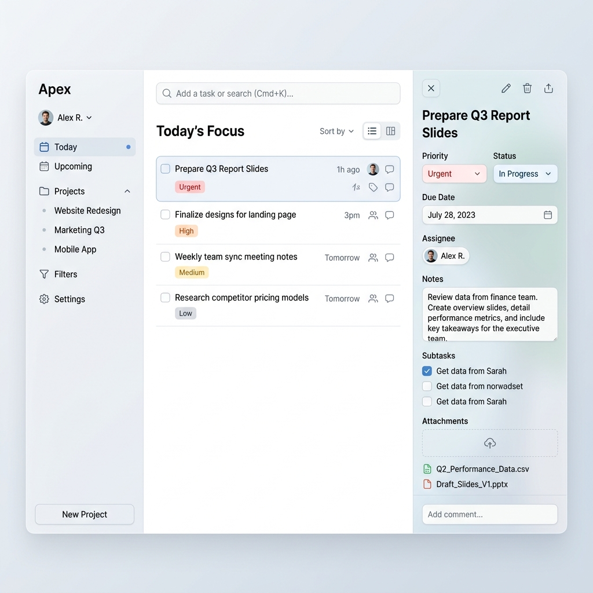

# Task Management Dashboard

A full-featured, collaborative Task Management Dashboard built with Node.js, Express, SQLite, and WebSockets.

## Features

- **Real-Time Sync**: Changes sync instantly across all clients using WebSockets.
- **Advanced Organization**: Projects, nested logic, and time blocking.
- **Quick Add Parsing**: Create tasks quickly with inline priorities (`!p1`) and assignees (`@JD`).
- **File Attachments**: Local file uploads using `multer`.
- **Integration Mocking**: Simulates external webhook triggers for Slack and Gmail.
- **Zero Configuration**: Uses `better-sqlite3` so no external database servers are required.

## Installation

1. `npm install`
2. `node server.js`
3. Navigate to `http://localhost:3000`

## Architecture

- **Backend**: Node.js + Express
- **Database**: SQLite3 (`better-sqlite3`)
- **Realtime**: `ws` native WebSockets
- **Frontend**: Vanilla ES6+, Modular CSS3
